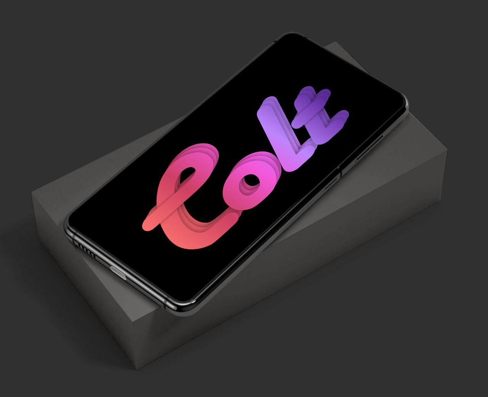

# Post Image :

# Device Changelog :

1. Merged latest changes from Zeelog
2. Switched to Source FP
3. Upstreamed kernel to 4.9.282
4. PlayStore Certified
5. CTS showing fail (everything working)
6. Switched to MIUI Camera Port
7. Fixed Hotword Enrollment (Ok Google)
8. Switched to AOSP FM
9. Fixed FM Radio
10. Added support for LDAC Bluetooth Codec
11. Cleanup some useless stuff

# Credits :

1. @lostark13 for FM Fix
2. @C0ndemned & others for testing

# Bugs :
Almost none you tell me
