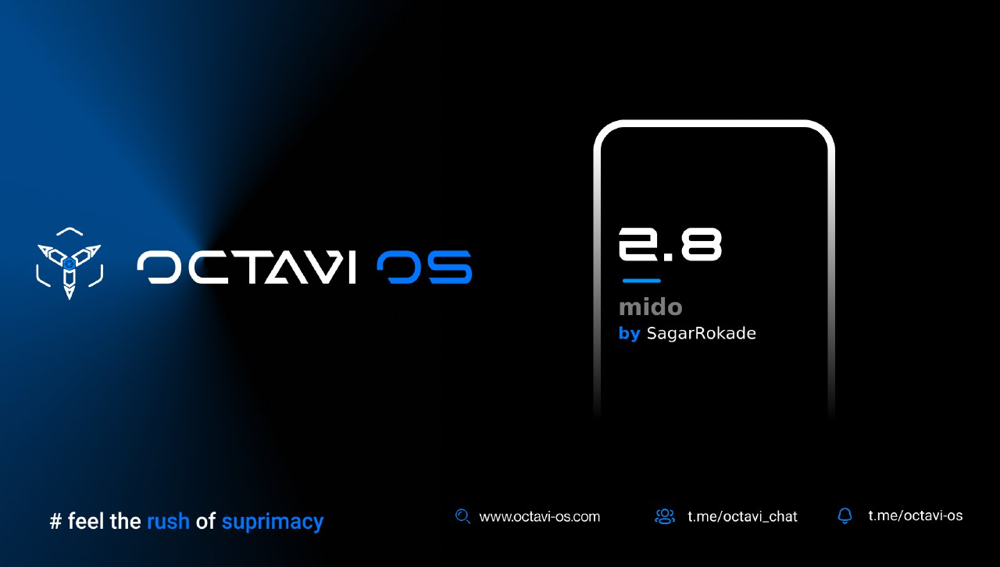

# Post Image

# Changelog
1. Added MIUI Camera as default
2. Optmised system
3. Fixed some minor bugs
4. Upstreamed kernel to 4.9.277
5. Fixed Front camera issue
6. Fixed hotspot issue showing no internet
7. Switched to Octavi Dialer
8. Call recording working

# Bugs
Almost none if found then report with proper logs

# Credits
1. @C0ndemned for testing my build

# Notes
Clean flash required due to UI enhancements
