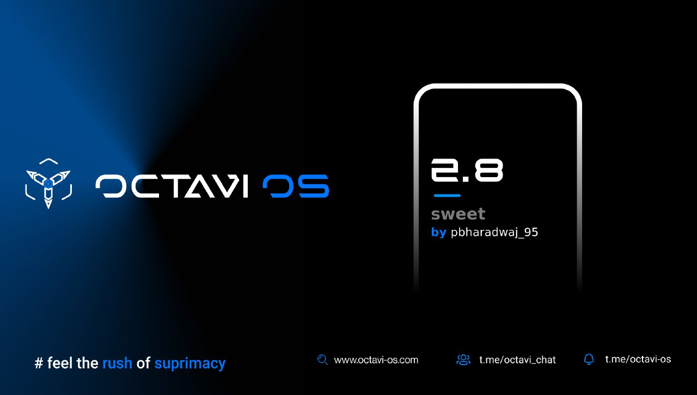

# Post Image

# Changelog
1. Fixed double tap to wake
2. Fixed FPS Info tile
3. Fixed Smart Charging
4. Fixed crash in Dirac sound
5. Fixed Call Recording
6. Fixed HD capable notification (Jio shit)
7. Removed 90Hz (causing battery drain)
8. Added support for aptX, aptX HD and LDAC Bluetooth codec
9. Switched to coral vibration configuration
10.Enabled Adaptive Brightness by default
11.Added support for colour calibration (Live Display)
12.Updated Carrier Config from CAF
13.Bump up doze brightness
14.Added notch overlay
15.Enabled sublte tick vibration
16.Added overlay to show ring around front camera while in use
17.Enabled Burn-in protection for status/navbar
18.Disable Pocket Mode
19.Disabled proximity during doze
20.Updated fp to Redfin August patch
21.Fixed Battery Health showing unavailable
22.Enabled white balance in display
23.Updated GCam Go
24.Disabled Global mode and CDMA choices
25.Added props for unlimited Google Photos storage (hopefully work)
 

# Bugs
Almost none if found then report with proper logs

# Credits
1. @vikky_plzz for testing my build

# Notes
CLEAN FLASH MANDATORY DUE TO UI CHANGE

# Flashing Instruction
https://telegra.ph/Flashing-on-the-Redmi-Note-10-ProMax-06-21

# Notes
Clean flash required due to UI enhancements
