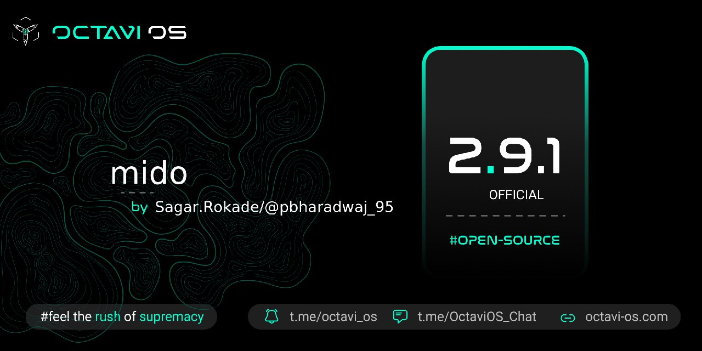

# Post Image

# Changelog
1. Optimised system
2. Fixed Wifi Display
3. CTS/Safetynet passed by default
4. Minor Bug fixes
5. Switched to AOSP FM

# Bugs
1. If found report with proper logs

# Credits
1. @C0ndemned for testing my build
