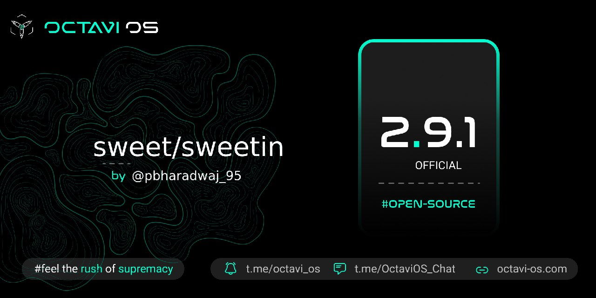

# Post Image

# Changelog
1. Fixed Google Account signout
2. Fixed Random reboots
3. System Optimisation and bug fixes
4. Shipped with ANX v204 (thanks to @AdarshGrewal for his nice work)
5. Fixed Video Calling (ViLTE)
6. Fixed Wifi Calling
7. Cleanup config fs
8. CTS/Safetynet passed
 

# Bugs
1. If found report with proper logs

# Credits
1. @AdarshGrewal bug thanks to him for fully functional ANX Camera

# Notes
1. ** Based on Prebuilt MIUI Vendor **
2. Read flashing instructions carefully before flashing
3. Use latest TWRP (recommended)
4. Use FlameGApps 11 Canary (recommended)

# Flashing Instruction
https://telegra.ph/Flashing-on-the-Redmi-Note-10-ProMax-06-21
