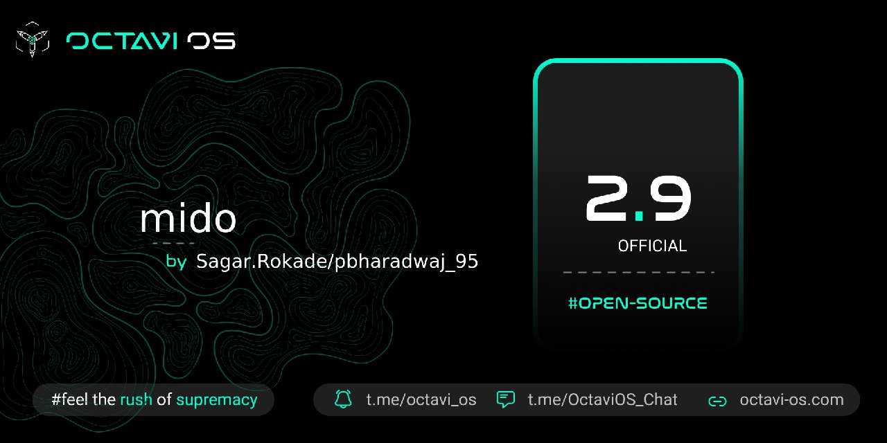

# Post Image

# Changelog
1. Added MIUI Camera as default
2. Optimised system
3. Fixed some minor bugs
4. Upstreamed kernel to 4.9.282
5. CTS/Safetynet passed by default without root
6. Play Store Certified
7. Switched to stock fp
8. Merged changes from Zeelog trees

# Bugs
1. FM dead for no reason
2. Rest you tell

# Credits
1. @C0ndemned for testing my build
