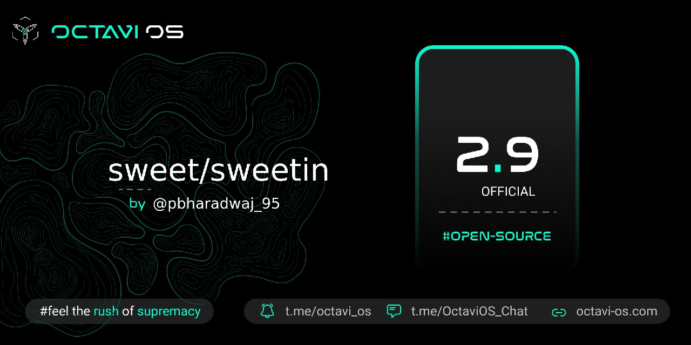

# Post Image

# Changelog
1. Fixed DC Dimming
2. CTS/Safetynet passed by default
3. Play Store Certified
4. Switched to stock fp
5. Switched to Vantom Kernel
6. Kernel upstreamed to 4.14.246
7. Switch to source Refresh Rate Control
8. Fixed Hotword Enrollment (basically Ok Google)
9. Switched to AOSP FM Stack
10.Fixed FM not working
11.Switched to Proton Clang
12.Added hacks to hide magisk much better
13.Bump up haptic level
14.Imported device-specific display configs
15.Switch to xiaomi-touch impl for dt2w
16.Enabled QPower and Deep Sleep for wifi
17.Removed Audio FX
18.Import stock WCNSS config
19.Switched to prebuilt libcameraservice
20.Added missing PowerOffAlarm blobs
21.Added support for stereo speaker in Audio HAL
22.Enabled Full Screen Aspect Ratio
23.Display Live Display Display Mode
24.Dropped prebuilt Power-Off charging
25.Added support for HBM (High Brightness Mode)
26.Added CABC functionality (Content Adaptive Brightness Control)
 

# Bugs
1. ViLTE (Operator Video Calling)

# Credits
1. @vikky_plzz for testing my build
2. @lostark13 for FM Radio, HBC & CABC
3. @redcliff-op for helping in kernel
4. @AdarshGrewal for OK Google

# Notes
** Based on Prebuilt MIUI Vendor **

# Flashing Instruction
https://telegra.ph/Flashing-on-the-Redmi-Note-10-ProMax-06-21
