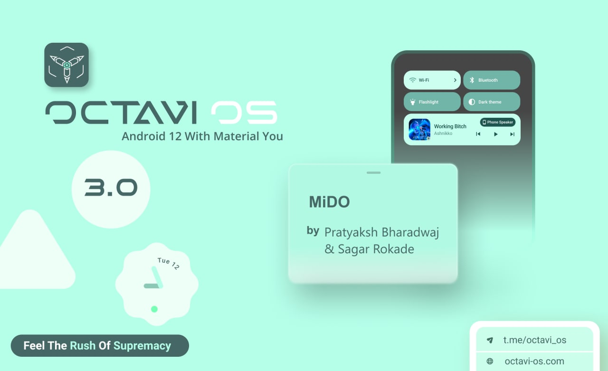

# Post Image

# Changelog
1. Initial Android 12 Build
2. CTS/Safetynet passed by default
3. Permissive build
4. Sleepy Kernel default
5. Kernel upstreamed to 4.9.286
6. Some apps might detect root so use Magisk

# Whats working
1. BT working
2. VoLTE working for Airtel & Jio
3. Fp working (goodix & fpc)
4. Camera working
5. Media working
6. Hotspot working

# Bugs
1. ViLTE (native video call)
2. Cast/WifiDisplay broken
3. DT2W could be dead

# Credits
1. @C0ndemned, ndroidLover & others for testing
2. @Sagarrokade006 & @Kingsmanz for fp fix
3. @Kingsmanz for camera & BT fix
