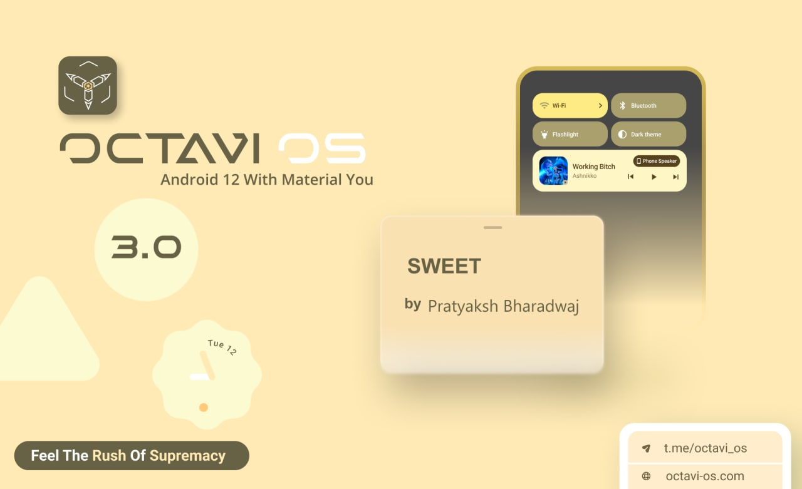

# Post Image

# Changelog
1. Initial Android 12 Build
2. SELinux Enforcing
3. CTS/Safetynet passed
4. GApps Inbuilt
5. CameraGo as default

# Whats working
1. VoLTE & VoWiFi (Tested on Airtel)
2. Widevine L1
3. Banking apps working
4. Fingerprint working
5. Refresh Rate controls

# Bugs
1. DT2W dead
2. Native Video Calling 
3. Wifi Display (not tested)

# Notes
1. ** Based on Prebuilt MIUI Vendor **
2. ** Based on prebuilt kernel **
3. No recovery can decrypt storage in Android 12
4. Use latest TWRP 3.5.2-11 by Nebrassy

# Flashing Instruction
https://telegra.ph/Flashing-on-the-Redmi-Note-10-ProMax-06-21
