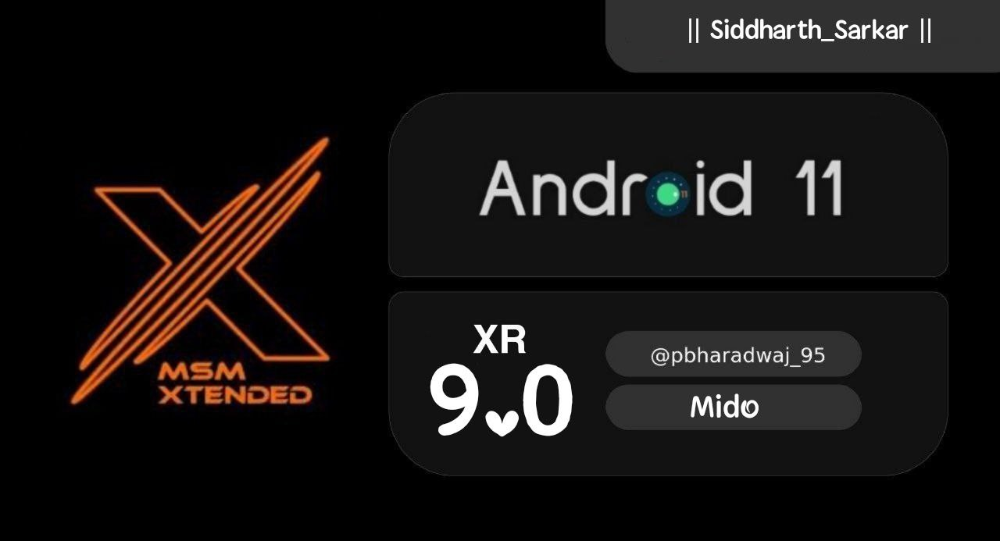

# Post Image

# Changelog
1. Added MIUI Camera as default
2. Optmised system
3. Fixed some minor bugs
4. Upstreamed kernel to 4.9.277
5. Switched to Octavi Dialer
6. Call recording working
7. Fixed HW button customisation from last build
8. Import LDAC blobs from Courbet MIUI 12.5.3.0
9. Updated fp to Redfin August fp
10. Added props for Unlimited Photo Storage in Google Photos
11. Fixed Mi Sound Enhancer crash in some cases

# Bugs
Almost none if found then report with proper logs

# Credits
1. @C0ndemned & @DhAiRyA3000 for testing my build
